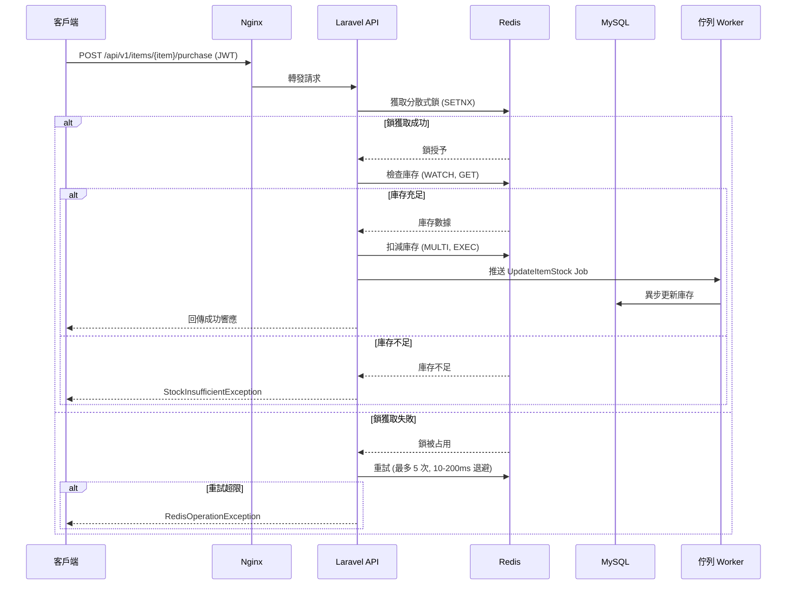

以下是優化後的中文版 Markdown 文件，針對 Laravel 高併發 API 範例進行了精簡、清晰化和結構化處理，保留所有必要技術細節，並添加了使用 Mermaid 語法繪製的流程架構圖，展示購買請求的處理流程。優化重點包括簡化語言、統一格式、提升可讀性，並確保專業性。

---

# Laravel 高併發 API 範例

本專案展示一個使用 Laravel 構建的 RESTful API，專為高併發庫存管理設計，結合 **Redis 原子操作**、**異步佇列** 和 **JWT 認證**，提供高效、安全的解決方案。專案採用 **Docker** 容器化，方便快速開發、測試和部署。

## 功能特性

- **RESTful API**：支援版本控制的端點（`/api/v1`），結構清晰且易於擴展。
- **JWT 認證**：基於 `tymon/jwt-auth`，支援註冊、登入、登出、獲取用戶資訊及 Token 刷新。
- **Redis 原子操作**：使用 `WATCH`、`MULTI`、`EXEC` 和 `SETNX` 實現高併發庫存扣減，防止超賣。
- **分散式鎖**：透過 Redis `SETNX` 實現商品操作鎖，支援最多 5 次重試（隨機退避 10-200ms）。
- **異步庫存更新**：Redis 扣減庫存後，透過 Laravel 佇列（`UpdateItemStock` Job）異步更新 MySQL，提升 API 響應速度。
- **自訂錯誤處理**：定義 `StockInsufficientException`（庫存不足）和 `RedisOperationException`（Redis 操作失敗）等異常，提供明確錯誤訊息和狀態碼。
- **Repository 模式**：解耦資料庫和 Redis 操作邏輯，提升代碼可維護性和可測試性。
- **軟刪除**：商品模型支援邏輯刪除（`deleted_at`），已刪除商品無法購買。
- **庫存保護**：資料庫層（`unsignedInteger`）和模型層（`setStockAttribute` Mutator）確保庫存永不為負。
- **完整測試套件**：包含 Feature 和 Unit 測試，涵蓋認證和商品購買功能，確保穩定性和可靠性。

## 系統架構圖

以下 Mermaid 流程圖展示購買請求的處理流程，說明客戶端、Laravel API、Redis、MySQL 和佇列之間的交互。



## 環境配置

專案基於 Docker 容器化，請確保已安裝 **Docker** 和 **Docker Compose**。

### 1. 複製專案

```bash
git clone https://github.com/BpsEason/laravel-high-concurrency-api.git
cd laravel-high-concurrency-api
```

### 2. 設定環境變數

複製 `.env.example` 並命名為 `.env`：

```bash
cp .env.example .env
```

編輯 `.env` 檔案，關鍵配置如下：

```env
APP_NAME="Laravel High-Concurrency API"
APP_ENV=local
APP_KEY= # 安裝後生成
APP_DEBUG=true
APP_URL=http://localhost

DB_CONNECTION=mysql
DB_HOST=mysql
DB_PORT=3306
DB_DATABASE=laravel
DB_USERNAME=root
DB_PASSWORD=root

REDIS_HOST=redis
REDIS_PORT=6379
REDIS_CLIENT=predis

QUEUE_CONNECTION=redis # 使用 Redis 作為佇列驅動

JWT_SECRET= # 安裝後生成

LOCK_MAX_RETRIES=5
LOCK_RETRY_DELAY_MIN=10000 # 微秒 (10ms)
LOCK_RETRY_DELAY_MAX=200000 # 微秒 (200ms)

TEST_USER_PASSWORD=password
```

### 3. 啟動 Docker 服務

`docker-compose.yaml` 定義以下服務：
- `app`：Laravel 應用（PHP-FPM）。
- `nginx`：Nginx Web 伺服器（監聽端口 80）。
- `mysql`：MySQL 8.0 資料庫。
- `redis`：Redis，用於緩存、佇列和分散式鎖。

啟動服務：

```bash
docker-compose up -d --build
```

### 4. 安裝依賴並生成密鑰

進入 `app` 容器並執行：

```bash
docker-compose exec app composer install
docker-compose exec app php artisan key:generate
```

### 5. 生成 JWT 密鑰

```bash
docker-compose exec app php artisan jwt:secret
```

### 6. 執行資料庫遷移和資料填充

```bash
docker-compose exec app php artisan migrate --seed
```

### 7. 啟動佇列 Worker

啟動佇列 Worker 處理 `UpdateItemStock` Job：

```bash
docker-compose exec app php artisan queue:work redis --queue=stock_updates
```

可選：使用 Supervisor 管理 Worker，`supervisord.conf` 已配置，自動運行於 `app` 容器。

### 8. 設置權限

若遇到儲存或緩存權限問題，執行：

```bash
docker-compose exec app chmod -R 775 storage bootstrap/cache
docker-compose exec app chown -R www-data:www-data storage bootstrap/cache
```

## API 端點

基礎 URL: `http://localhost/api/v1`

| 方法   | 端點                              | 描述                               | 認證要求     |
|--------|-----------------------------------|------------------------------------|--------------|
| `POST` | `/auth/register`                  | 使用者註冊                         | 無           |
| `POST` | `/auth/login`                     | 使用者登入並獲取 JWT Token       | 無           |
| `POST` | `/auth/me`                        | 獲取當前認證使用者資訊             | JWT Token    |
| `POST` | `/auth/logout`                    | 使用者登出 (使 Token 失效)       | JWT Token    |
| `POST` | `/auth/refresh`                   | 刷新過期 JWT Token               | JWT Token    |
| `GET`  | `/items`                          | 獲取所有商品列表                   | 無           |
| `GET`  | `/items/{item}`                   | 獲取單一商品詳情                   | 無           |
| `POST` | `/items/{item}/purchase`          | 購買商品並扣減庫存                 | JWT Token    |

## 執行測試

運行測試套件：

```bash
docker-compose exec app php artisan test
```

## 常見問題 (FAQ)

### 1. 佇列不運行？

- 確認 `.env` 中 `QUEUE_CONNECTION=redis`。
- 確保已啟動佇列 Worker：

```bash
docker-compose exec app php artisan queue:work redis --queue=stock_updates
```

### 2. JWT 錯誤（如 Token 無效）？

- 確認 `.env` 中已設置 `JWT_SECRET`。若未設置，執行：

```bash
docker-compose exec app php artisan jwt:secret
```

### 3. Redis 與 MySQL 庫存不一致？

若發生不一致，可使用自訂 Artisan 命令同步庫存：

```bash
docker-compose exec app php artisan app:sync-stock # 同步所有商品
docker-compose exec app php artisan app:sync-stock {itemId} # 同步特定商品，如 php artisan app:sync-stock 1
```

**注意**：需自行實現 `app:sync-stock` 命令，位於 `app/Console/Commands`，從 MySQL 讀取庫存並更新 Redis。

### 4. 服務無法訪問（如 502 Bad Gateway）？

- 檢查日誌：

```bash
docker-compose logs nginx
docker-compose logs app
```

- 確認 `nginx/default.conf` 中 `fastcgi_pass app:9000;` 正確指向 PHP-FPM。
- 檢查 `supervisord.conf` 中 `php-fpm` 進程是否正常運行。

---
